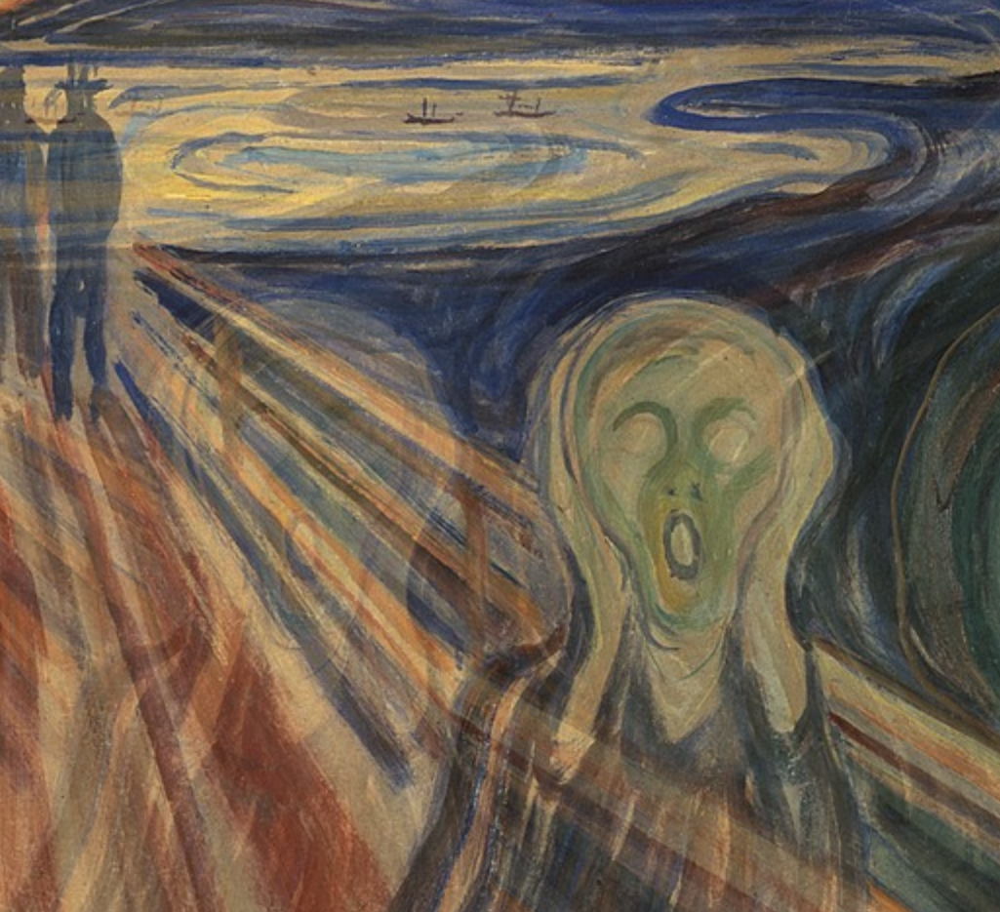

# part 1
## I find the use of the "Double Exposure" imaging technique from the movie "LALALAND" inspiring. 

### This technique involves the combination of distinct images – a vibrant bar logo against the backdrop of a Hollywood night and the heroine dancing in a champagne-filled setting. I aim to incorporate this technique into my project because it has the potential to enhance the storytelling within a single shot. Through visual elements, it effectively conveys the mission of expressing intricate emotional story in a shot.
#### part 2
##### I have incorporated this technique into Edvard Munch's painting, "The Scream," enabling a small, transparent figure to overlap with the painting as the mouse slides across it. This feature symbolizes the wandering soul within the artwork.

###### Demo code picture (main part)
###### here is the name of my work in my main files ： IDEA_9103_WK_7_Complete/IDEA_9103_WK_7_Complete/index.html
